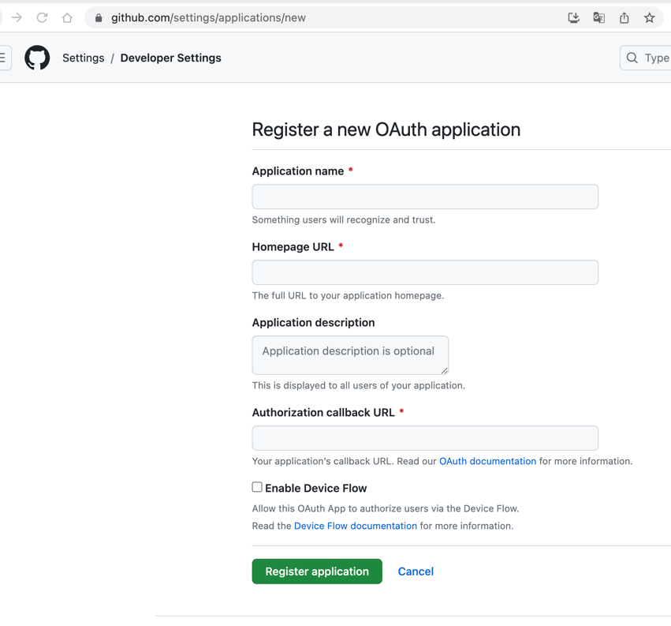
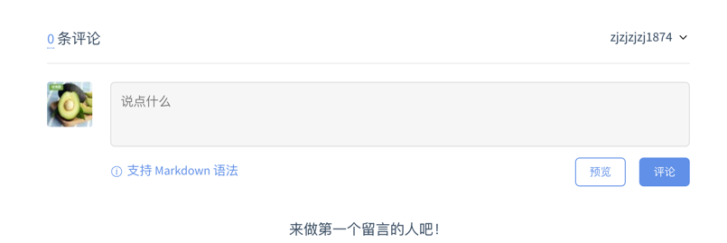

<article-title title="站点集成gitalk"></article-title>

<article-meta date="2023年7月28日"></article-meta>

---  
## Docsify集成Gitalk

### 申请应用
GitHub[申请地址](https://github.com/settings/applications/new)


### 填写信息
将以下信息修改后,然后放置在index.html页面中,再引入js
```js
<script>
    // 举例 仓库名,github.com/user-A/a-repo 下面一次需要怎么对应填写
    const gitalk = new Gitalk({
        clientID: 'clientId',   // github注册应用后的ClientID
        clientSecret: 'secret', // github注册应用后的ClientSecret
        repo: 'a-repo',         // 对应上面的a-repo     
        owner: 'user-A',        // 对应上面user-A
        admin: [
            'user-A',
        ],                      // 只需要填写user-A
        // facebook-like distraction free mode
        distractionFreeMode: false,
    });
</script>
<script src="//cdn.jsdelivr.net/npm/docsify/lib/plugins/gitalk.min.js"></script>
<script src="//cdn.jsdelivr.net/npm/gitalk/dist/gitalk.min.js"></script>
```

### 访问页面
