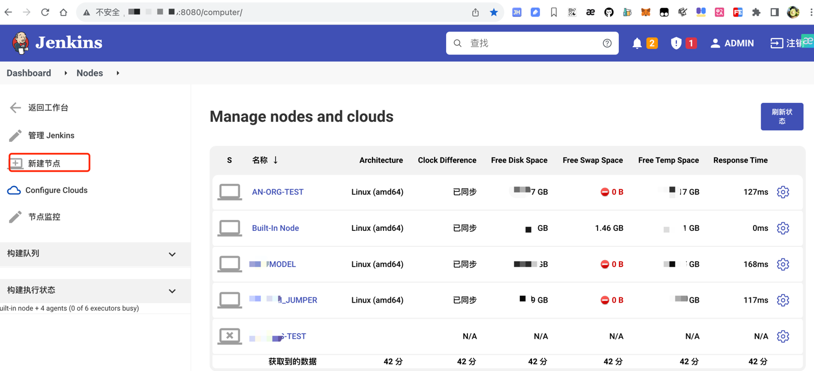
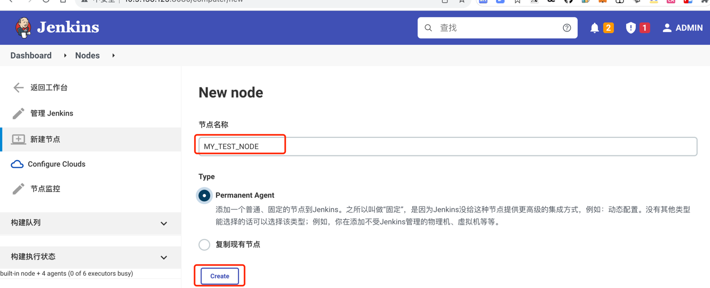
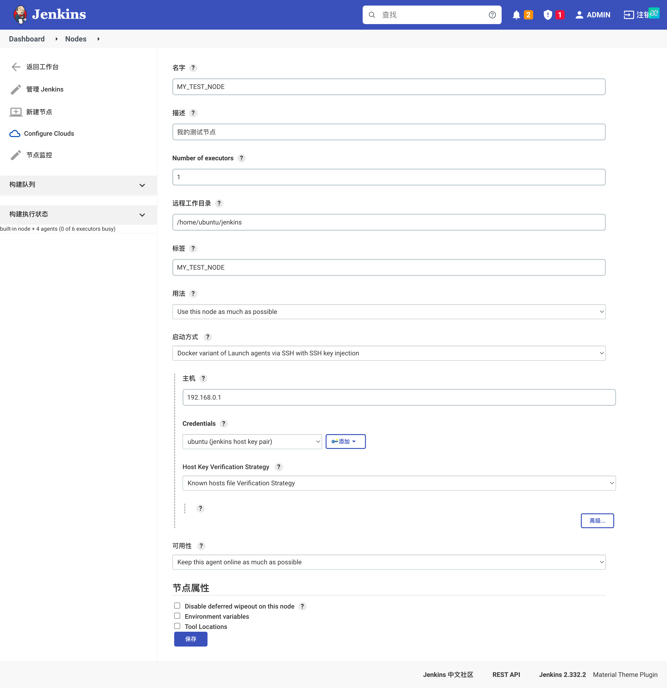
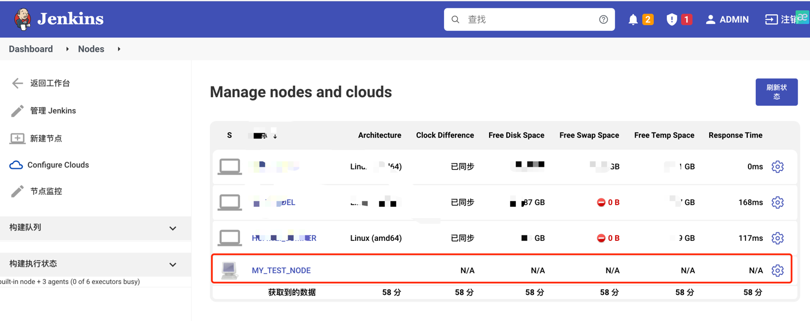

<article-title title="Jenkins新增Node"></article-title>

<article-meta created="2023年08月24日" updated="2023年08月24日"></article-meta>

--- 

### 添加Node
向Jenkins中添加节点作为agent,方便在Jenkins中使用.

* 点击`新建节点`
  

* 选择新节点类型(新建或者拷贝已存在)
  

* 补充节点信息
  

* 查看新增节点信息
  

> * 请将Jenkins机器的公钥放到新节点的~/.ssh/authorized_keys下面
> * 请在新节点的机器上执行`sudo apt-get update && sudo apt-get install default-jdk -y`.
