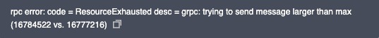
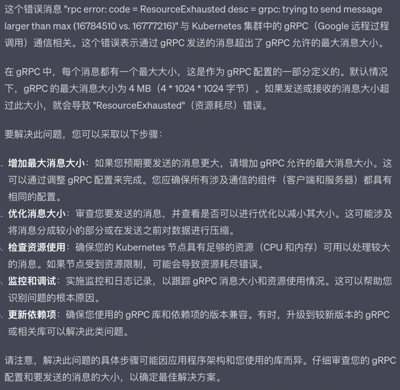

<article-title title="记一次K8S节点状态异常修复"></article-title>

<article-meta date="2023年10月08日"></article-meta>

--- 

### 节点状态
在控制台发现一台测试集群的k8s节点状态异常,查看事件显示报错如下:

  

出现问题现在是马上找GPT取经问路啊,结果它给我的回答如下:

  

然后我知道我靠不到他了,赶紧把问题跑到群里.嘿嘿

### 解决步骤
* 设置Docker启动超时时间

  在节点上`/usr/lib/systemd/system/docker.service`文件，[service]下添加一行`TimeoutStartSec=600`
  
  执行`systemctl daemon-reload`使配置生效
* 重启Docker
  ```shell
  systemctl restart docker
  ```
* 清理多余容器及镜像
  ```shell
  docker system prune -f
  ```
* 再重启Docker和Kubectl
  ```shell
  systemctl restart docker && systemctl restart kubelet
  ```

至此,重启完后节点恢复正常.

> 有时候GPT回答的问题并不十分有效,如果自己当前问的领域不是钻研很深,根本无法区分GPT在胡说还是在真的解决问题,诶~
