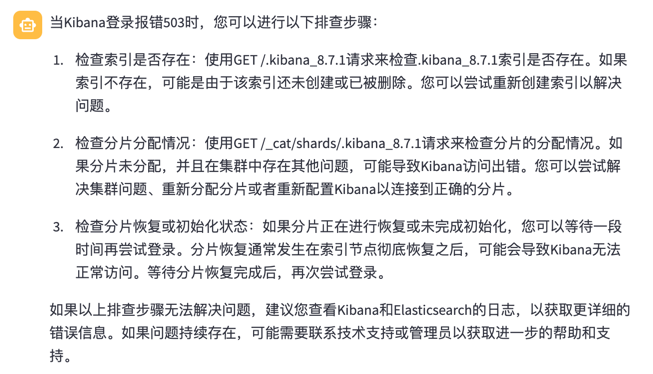
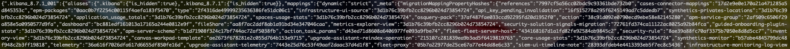
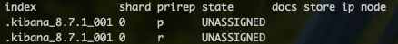
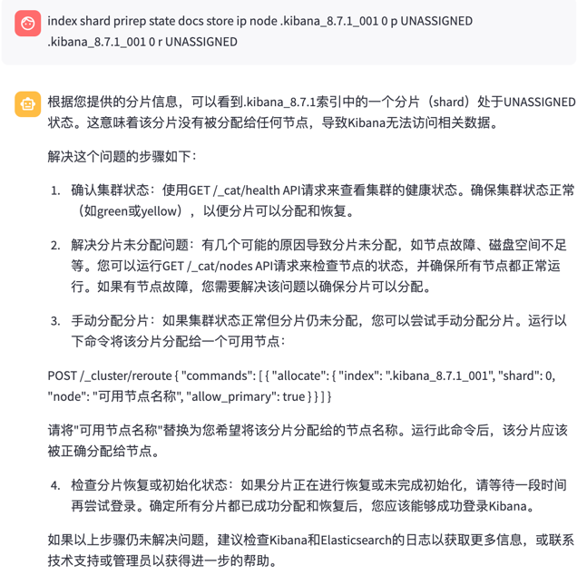
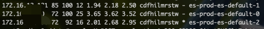
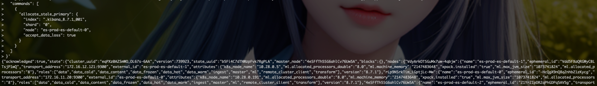
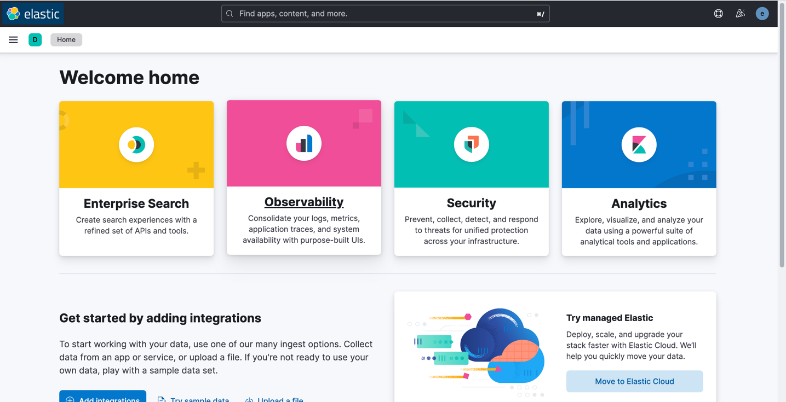

<article-title title="Kibana报错503排查"></article-title>

<article-meta created="2023年09月04日" updated="2023年09月04日"></article-meta>

--- 
#### EFK版本
* elasticsearch 8.7.1
* kibana 8.7.1
* filebeat 8.7.1

> es+kibana使用ECK部署,下期出一个使用ECK部署ES+Kibana的文档教程.


#### 现象
前两天登陆EFK(Elasticsearch+Kibana+Filebeat)查看日志时,输入登陆用户和密码后,页面报错:
```html
503 Service Unavailable[all shards failed: search_phase_execution_exception\n\tRoot causes:\n\t\tno_shard_available_action_exception: null]: all shards failed
```
查看es pod的日志报错:


初步判定是索引分区的问题,开始着手排查问题.

#### 排查问题
将问题丢给GPT看它怎么说:



于是按照GPT的指引来排查.(Kibana登陆不上去,只能去容器中使用CURL来调用ES的api排查)

* 检查索引是否存在
```shell
// 查看索引
curl -X GET -u elastic:changetoYourPwd -k http://es-prod-es-http.elastic-system:9200/.kibana_8.7.1
```


经排查,kibana_8.7.1索引正常,接下来排查第二步;

* 检测分片分配情况
```shell
// 查看索引的分片分配情况
curl -X GET -u elastic:changetoYourPwd 'http://es-prod-es-http.elastic-system:9200/_cat/shards/.kibana_8.7.1?v'
```


这里看不懂,把结果丢给GPT去翻译:



发现是这个索引分片未分配,那就解决分片未分配问题.

* 解决分片分配问题
  * 先查看可用Node
  ```shell
  // 查询es的node情况
  curl -X GET -u elastic:changeme http://es-prod-es-http.elastic-system:9200/_cat/nodes
  ```
  
  
  
  这里`es-prod-es-default-0, es-prod-es-default-1, es-prod-es-default-2`是下面需要用到的
  * 手动为分片分配节点
  ```shell
  // 手动将分片分配到某个ES的node
  curl -X POST -u elastic:changeme http://es-prod-es-http.elastic-system:9200/_cluster/reroute -H 'Content-Type: application/json' -d '{
    "commands": [
      {
        "allocate_stale_primary": {
          "index": ".kibana_8.7.1_001",
          "shard": "0",
          "node": "es-prod-es-default-0",
          "accept_data_loss": true
        }
      }
    ]
  }'
  ```
  
  
  
  看起来调用后没报错,正常了,过会儿刷新页面,ok成功了.

  

> 一切大功告成, 很多问题可能都超出自己的知识范围了,不过大家合理使用GPT,能够在问题定位和解决上轻松许多.


  
