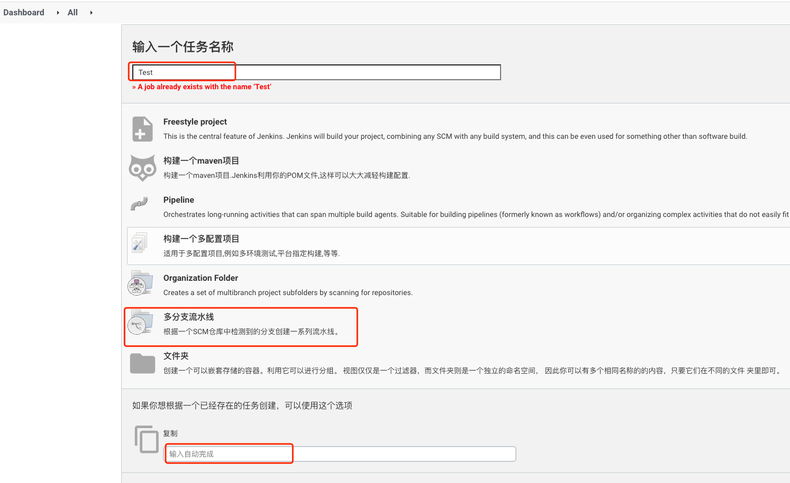
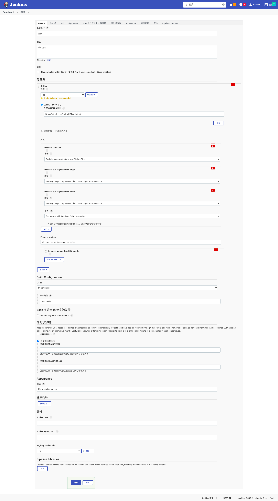

<article-title title="Pipeline流水线"></article-title>

<article-meta created="2023年08月28日" updated="2023年08月28日"></article-meta>

--- 

### 添加流水线
向Jenkins中添加流水线,为项目持续集成部署服务.

* 点击`新建Item`
  

* 选择Item类型(新建或者拷贝已存在)
  
这里我们选择`多分支流水线`,能够一个仓库根据不同分支来操作流水线

* 补充节点信息
  

* 查看新增Item信息
  

