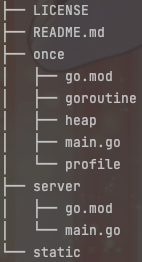
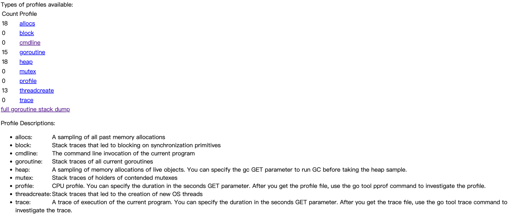
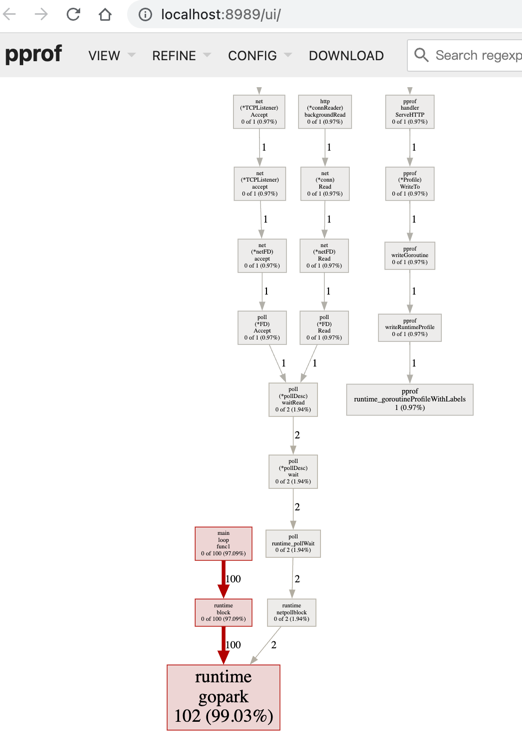
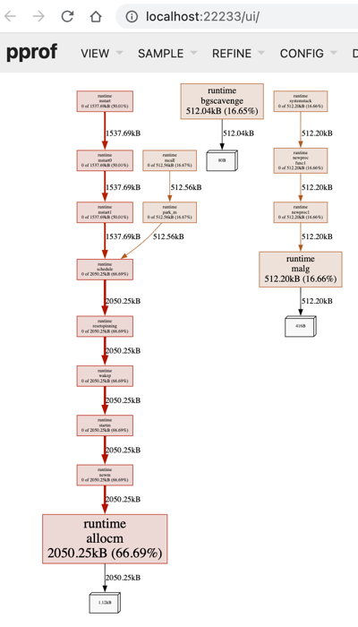
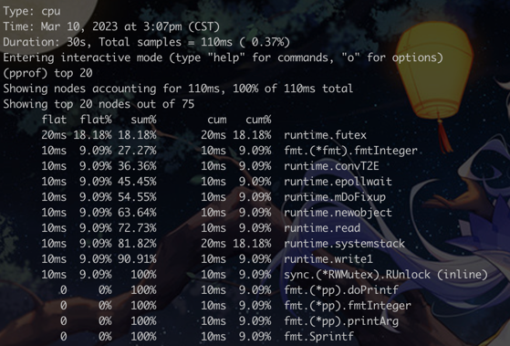
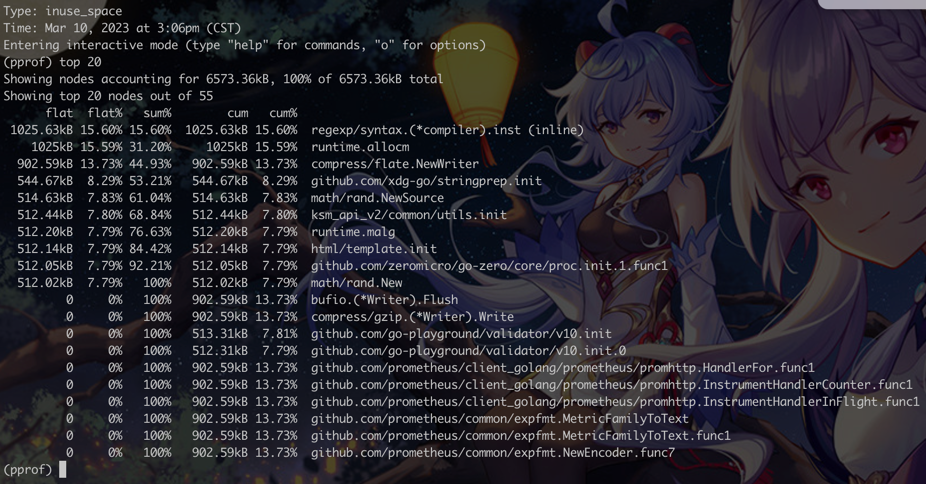
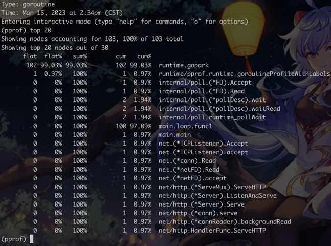

<article-title title="PPROF实战运用"></article-title>

<article-meta date="2023年7月25日"></article-meta>

--- 

### 准备
- Go运行环境
- Graphviz开源图形可视化软

### 项目结构

- once:为工具性,test用例或者一次性程序添加pprof
- server:为web服务型应用添加pprof
- static:静态资源,主要存储Markdown引用的图片

### 初识pprof
pprof是golang自带的程序性能分析工具,prof是profile(画像)的缩写.
我觉得全称为Program Profile更贴切:程序画像,即程序运行时的一些资源画像,如:内存,CPU,协程,锁等等;
- 分析类型
  
    - allocs:所有过去内存分配的采样
    - block:阻塞分析
    - cmdline:当前程序的命令行调用
    - goroutine:goroutine分析
    - heap:内存分析
    - mutex:互斥锁分析
    - profile:cpu分析
    - threadcreate:导致创建新操作系统线程的堆栈跟踪
    - trace:当前程序的执行轨迹
- 常用的:CPU,Goroutine,Memory

### pprof分析

#### 数据获取
- 工具性代码或一次性程序:参考[once](./once/main.go),跑一次后生成临时文件,可以直接使用go tool pprof查看
- 服务型应用:参考[server](./server/main.go),暴露路由,需要访问 => http://localhost:8080/debug/pprof

#### 数据分析
- `go tool`查看:支持所有类型
    - `go tool pprof http://localhost:8080/debug/pprof/goroutine`
      
    - `go tool pprof goroutine`
      
    - `go tool pprof -http=:8989 http://localhost:8080/debug/pprof/goroutine` (注意:如果没有Graphviz的话,无法正常渲染)
      

- 直接访问(仅支持应用型):`http://localhost:8080/debug/pprof`
  

- 图表展示:pprof+Graphviz => `pprof -http=:22233 http://localhost:8080/debug/pprof/heap`

  

#### 常用命令
- `go tool`交互命令
    - `help`: 查看所有子命令; help + cmd,如:`help top`
    - `top`: 以文本形式输出最耗时的函数(支持排序)
    - `list`: 查看具体函数输出
    - `traces`: 追踪函数执行情况
    - `web`: 在浏览器打开

#### 常用指标
- CPU Profile
    - total: 采样时总共CPU运行时间
    - flat: 函数在样本中处于运行状态所花费的时间(真正花时间的底层函数,调用链上的中间函数不算)
    - flat%: flat/total
    - sum%: 自己以及所有前面的Flat%的累积值。解读方式：表中第3行Sum%=36.36%，意思是前3个函数（运行状态）的计数占了总样本数的36.36%
    - cum: 累积量:函数在样本中运行所花的时间,只要这个函数出现在调用栈中,就算进去(注意:这个函数不一定会花时间,但是它及它下层的函数可能会花时间,所以对我们来说,追踪这个函数就有意义了).
    - cum%: cum/total
    - 最后一列表示函数名

  

- 内存Profile
    - total: 采样时的内存总占用
    - flat: 为函数分配的内存,不包含它调用其他函数造成的内存分配
    - flat%: flat/total
    - sum%: 自己以及所有前面的Flat%的累积值
    - cum: 累积量:函数在样本中运行所分配的内存,包含它调用其他函数分配的内存之和
    - cum%: cum/total
    - 最后一列表示函数名

  

* Goroutine Profile
  * total: 采样时的总协程数量
  * flat: 处于当前状态的协程数量
  * flat%: flat/total
  * sum%: 自己以及所有前面的Flat%的累积值
  * cum: 经历过该函数的协程数量
  * cum%: cum/total
  * 最后一列表示函数名
  
  

### 插件安装

#### 安装Graphviz
简介:Graph Visualization Software(图形可视化软件).Graphviz是开源图形可视化软件。图形可视化是一种将结构信息表示为抽象图和网络图的方法。它在网络、生物信息学、软件工程、数据库和网页设计、机器学习以及其他技术领域的可视化界面中有着重要的应用。
- MacOS
    - homebrew安装:`brew install graphviz` :如果因为package的问题,可以先`brew update`
    - 确认是否安装成功:`dot --version || brew info graphviz`
- Windows安装
    - [下载msi安装包](https://graphviz.gitlab.io/_pages/Download/windows/graphviz-2.38.msi)
- Linux
    - Ubuntu/Debian:`sudo apt install graphviz`
    - CentOS/Redhat:`sudo yum install graphviz`
  
#### 安装Google的pprof
- 安装
    - go1.16之后:`go install github.com/google/pprof@latest`
    - go1.14之后:`go get -u github.com/google/pprof`
- 验证
    - `pprof -h`
    - 如果报错:`command not found`,执行`echo 'export PATH=$PATH:$(go env GOPATH)/bin' >> .zshrc`,然后`source .zshrc`,再次执行即可
  
#### pprof使用
- 打开已存在的文件:`pprof -http=:8080 cpu.pdf`
- 打开接口文件:`pprof -http=:8081 http://localhost:8888/debug/pprof/goroutine`

### 参考文献
- [Russ Cox使用pprof优化代码](https://go.dev/blog/pprof)
- [Google pprof](https://github.com/google/pprof)
- [Graphviz官网](https://www.graphviz.org/)
- [Drawing graphs with dot](https://www.graphviz.org/pdf/dotguide.pdf)