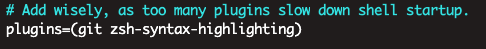

<article-title title="ZSH安装与插件配置"></article-title>

<article-meta created="2023年9月05日" updated="2023年9月05日"></article-meta>

---  

### Ubuntu安装
* 安装zsh
```shell
sudo apt-get install zsh
```
* 安装oh-my-zsh
```shell
sh -c "$(wget -O- https://raw.githubusercontent.com/ohmyzsh/ohmyzsh/master/tools/install.sh)"
```
    如果响应很慢,建议本地挂梯子下载`install.sh`文件,然后copy到服务器
    ```shell
    wget https://raw.githubusercontent.com/ohmyzsh/ohmyzsh/master/tools/install.sh
    ```
* 安装完成后,终端会自动切换到zsh.

### MacOs安装
* 安装zsh
```shell
brew install zsh
```

* 将Zsh设置为默认shell
```shell
sudo chsh -s /usr/local/bin/zsh
# 输入密码
```

* 安装oh-my-zsh
```shell
sh -c "$(wget -O- https://raw.githubusercontent.com/ohmyzsh/ohmyzsh/master/tools/install.sh)"
```
    如果响应很慢,建议本地挂梯子下载`install.sh`文件,然后copy到服务器
    ```shell
    wget https://raw.githubusercontent.com/ohmyzsh/ohmyzsh/master/tools/install.sh
    ```
* 安装完成后,终端会自动切换到zsh.


### 插件安装

> 国内如果Github拉取插件很慢,建议从Gitee拉取
* 安装高亮
  * 下载插件
    ```shell
    git clone https://github.com/zsh-users/zsh-syntax-highlighting.git ~/.oh-my-zsh/plugins/zsh-syntax-highlighting 
    ```
  * 设置Plugins `vim ~/.zshrc`
  
      

  * 重载配置
  ```shell
    source ~/.zshrc
  ```

* 安装代码补全
  * 下载插件
    ```shell
      git clone git://github.com/zsh-users/zsh-autosuggestions ~/.oh-my-zsh/plugins/zsh-autosuggestions 
    ```
  * 设置Plugins `vim ~/.zshrc`
  
      

  * 重载配置
  ```shell
    source ~/.zshrc
  ```
  
* 极速跳转`autojump`
  * 安装`autojump`
  ```shell
  sudo apt-get install autojump
  ```
  * 添加`autojump`配置到`zsh`配置
  ```shell
  echo '[[ -s /usr/share/autojump/autojump.zsh ]] && . /usr/share/autojump/autojump.zsh' >> ~/.zshrc
  ```
  > 注意,如果上面不生效,使用下面的尝试 [ -f /opt/homebrew/etc/profile.d/autojump.sh ] && source /opt/homebrew/etc/profile.d/autojump.sh
  查看[Issue](https://github.com/wting/autojump/issues/656)
  * 重载`zsh`配置
  ```shell
  source ~/.zshrc
  ```